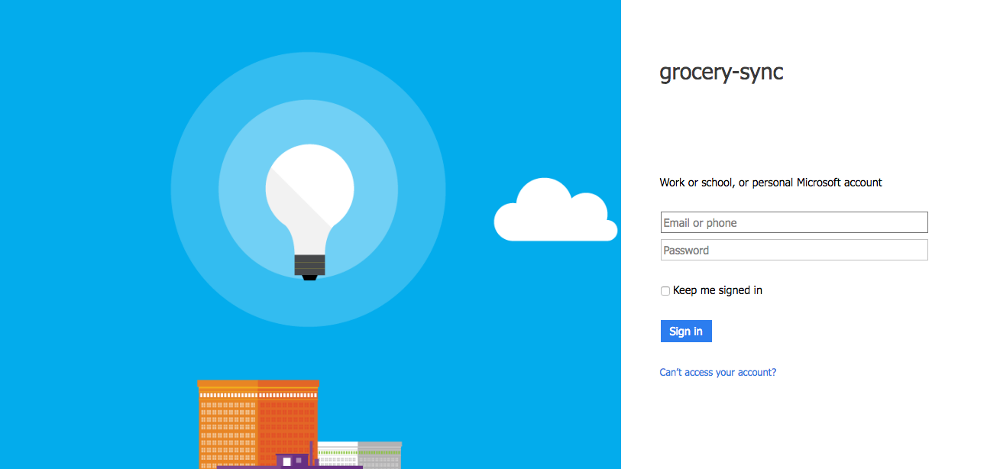

In this guide, we will use Active Directory with Auth Code Flow as an example for the OpenID Provider (abbreviated OP) but similar steps apply for any other OP that you intend to use.

## Creating an app on Azure

Watch the video below to learn how to create an app on Azure and use the credentials in the Sync Gateway config file.

[//]: # "TODO: Link to video."
<video src="https://cl.ly/0G34373Q0S2z/azure.mp4" controls="true"></video>

## Setting Up Sync Gateway

With the Azure app you created in the previous section you can now configure Sync Gateway. Create a new file called `sync-gateway-config.json` with the following:

```javascript
{
  "log": ["*"],
  "databases": {
    "grocery-sync": {
      "server": "walrus:",
      "oidc": {
        "providers": {
            "AzureAuthFlow" : {
                "issuer":"https://sts.windows.net/99d099f9-e20...b8f4312dc1b8/",
                "client_id":"3945cb...-d8b687b56836",
                "validation_key":"lFsn9i/2...YN4EEWI/uhGVM+vM=",
                "callback_url":"http://localhost:4984/default/_oidc_callback",
                "register":true
            }
        }
      },
      "sync": `
        function(doc, oldDoc) {
          var username = doc.owner;
          if (!username)
            username = oldDoc.owner;
          if (!username)
            throw({forbidden : "item must have an owner"});
          var channelName = "ch-" + username;
          access(username, channelName);
          channel(channelName);
        }
      `
    }
  }
}
```

[Download Sync Gateway](http://www.couchbase.com/nosql-databases/downloads#couchbase-mobile) and start it from the command line with this configuration file:

```bash
~/Downloads/couchbase-sync-gateway/bin/sync_gateway sync-gateway-config.json
```

To test that everything is setup correctly open a web browser at [http://localhost:4984/grocery-sync/_oidc](http://localhost:4984/grocery-sync/_oidc). You are then redirected to login and to the login screen.



The browser is then redirected to [http://localhost:4984/grocery-sync/\_oidc_callback](http://localhost:4984/grocery-sync/_oidc_callback) with additional parameters in the querystring, and Sync Gateway returns the response:

```javascript
{
	id_token: "eyJ0eXAiOiJKV1Q...UIoeMAV7RqCAR05BSEU9KQ-TabJi2VMwl_gtBnreXtg",
	refresh_token: "AQAB...PRaoO3wpq_yfAq7gYxHTXTyMN44bIA4v8j_h6nhsm4pQX3u8_jh25iPr-T1chiAA",
	session_id: "a99ec3faad8038ed54a885e73ea2b988a41d8a99",
	name: "sts.windows.net%2F99d0994cd6...LRTqoPJTk29kZUjMRo"
}
```

You can then verify the validity of the `session_id` by setting it in the request header. Using curl, that would be the following.

```bash
curl -vX GET -H 'Content-Type: application/json' \
             --cookie 'SyncGatewaySession=c518975db2ad094548188a232a875ea547bce966' \
             'http://localhost:4984/grocery-sync/'
```

## Setting Up Couchbase Lite

With Sync Gateway up and running you can now use the Couchbase Lite Authenticator class. To save time, you will clone and run a sample app called **Grocery Sync** where OpenID Connect is already implemented.

### iOS

The [openid branch of Grocery Sync iOS](https://github.com/couchbaselabs/Grocery-Sync-iOS/tree/openid) is a working sample that demonstrates how to use OpenID Connect with the Couchbase Lite iOS SDK and Sync Gateway.

1. Clone the repository: `git clone https://github.com/couchbaselabs/Grocery-Sync-iOS.git`
2. Checkout on the `openid` branch `git checkout origin/openid`
3. [Download Sync Gateway](http://www.couchbase.com/nosql-databases/downloads#couchbase-mobile)
4. Start Sync Gateway with the config file you created in the previous step: `~/path/to/sync_gateway sync-gateway-config.json`
5. In `AppDelegate.m`, replace the `kServerDbURL` with the URL of your Sync Gateway instance `http://localhost:4984/grocery-sync`

You can login with the Active Directory account using the Auth Code Flow.

Then, open the `Users` tab of the Admin UI at [http://localhost:4985/_admin/db/grocery-sync/users](http://localhost:4985/_admin/db/grocery-sync/users). Notice a new user is registed.

### Android

The [feature/openid branch of Grocery Sync Android](https://github.com/couchbaselabs/GrocerySync-Android/tree/feature/openid) is a working sample that demonstrates how to use OpenID Connect with the Couchbase Lite Android SDK and Sync Gateway.

1. Clone the repository: `git clone https://github.com/couchbaselabs/GrocerySync-Android.git`
2. Checkout on the `feature/openid` branch `git checkout origin/feature/openid`
3. [Download Sync Gateway](http://www.couchbase.com/nosql-databases/downloads#couchbase-mobile)
4. Start Sync Gateway with the config file you created in the previous step: `~/path/to/sync_gateway sync-gateway-config.json`
5. In `Application.java`, replace the `SERVER_DB_URL` with the URL of your Sync Gateway instance `http://10.0.2.2:4984/grocery-sync` (or `10.0.3.2` if you're running an Genymotion emulator).

You can login with the Active Directory account using the Auth Code Flow.

Then, open the `Users` tab of the Admin UI at [http://localhost:4985/_admin/db/grocery-sync/users](http://localhost:4985/_admin/db/grocery-sync/users). Notice a new user is registered.

> If you ran the app on both platforms and logged in with the same Active Directory account then list items should sync across devices/emulators.