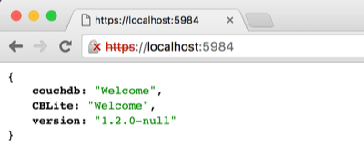

Couchbase Lite supports SSL for peer-to-peer replications. This guide describes how to enable SSL on the Listener and then start a replication over https.

## Generate a certificate

Before passing the certificate to the application you must generate it. You can do so with the following OpenSSL commands.

- Generate a self-signed certificate

```bash
openssl req -x509 -sha256 -nodes -days 365 -newkey rsa:2048 -keyout privateKey.key -out certificate.crt
```

- Convert the certificate file and private key to PKCS#12 (.pfx .p12)

```bash
openssl pkcs12 -export -out certificate.pfx -inkey privateKey.key -in certificate.crt
```

> **Note:** Those commands were taken from the [sslshopper](https://www.sslshopper.com/article-most-common-openssl-commands.html) guide.

## Bundling the certificate

### Android

In your Android Studio project, create an [Android assets folder](http://www.android-examples.com/create-assets-folder-in-android-studio/) if it doesn't already exist. Then, import the `.pfx` file you created previously into the assets folder. In one of the activity classes, use the following to copy the certificate from the assets location to the files directory. This step is required because the Listener expects the certificate as an instance of the Android `File` class.

```java
InputStream inputStream = null;
try {
    inputStream = getAssets().open("certificate.pfx");
} catch (IOException e) {
    e.printStackTrace();
}

File certificateFile = new File(this.getFilesDir(), "certificate.pfx");
OutputStream outputStream = null;
try {
    outputStream = new FileOutputStream(certificateFile);
} catch (FileNotFoundException e) {
    e.printStackTrace();
}

byte[] buffer = new byte[1024];
int read;
while ((read = inputStream.read(buffer)) != -1) {
    outputStream.write(buffer, 0, read);
}
```

## Starting the Listener

### Android

Next, you can instantate the Listener with a list of properties.

```java
Manager manager = null;
try {
    manager = new Manager(new AndroidContext(this), Manager.DEFAULT_OPTIONS);
} catch (IOException e) {
    e.printStackTrace();
}

Properties listenerProperties = new Properties();
listenerProperties.setProperty(Serve.ARG_ACCEPTOR_CLASS, "Acme.Serve.SSLAcceptor");
listenerProperties.setProperty(SSLAcceptor.ARG_KEYSTORETYPE, "PKCS12");
listenerProperties.setProperty(SSLAcceptor.ARG_KEYSTOREFILE, certificateFile.getAbsolutePath());
listenerProperties.setProperty(SSLAcceptor.ARG_KEYSTOREPASS, "cbmobile");
listenerProperties.setProperty(SSLAcceptor.ARG_PORT, String.valueOf(suggesterPort));

LiteListener listener = new LiteListener(manager, suggesterPort, new Credentials("", ""), listenerProperties);

Thread thread = new Thread(listener);
thread.start();
```

The path to the certificate is passed as a string (`certificateFile.getAbsolutePath()`), make sure to replace "cbmobile" with the password you chose when generating the certificate.

Build and run. To check that the certificate is used you can access the Listener from the browser.

Map the Listener's port running on the Android emulator to the same port on your machine.

```
adb forward tcp:5984 tcp:5984
```

Open [https://localhost:5984](https://localhost:5984), the browser will an unstrustred certificate warning. That's expected since you created a self signed certificate and a peer-to-peer context, certificates are generally self-signed because there's no authority to check it against.



## Starting a replication

### Android

By default, the replication running with https will stop if the certificate is self-signed because it's considered unstrusted. Use the following to override this behaviour and start a replication.

```java
Database database = null;
try {
    database = manager.getDatabase("todo");
} catch (CouchbaseLiteException e) {
    e.printStackTrace();
}

CouchbaseLiteHttpClientFactory clientFactory = new CouchbaseLiteHttpClientFactory(database.getPersistentCookieStore());
clientFactory.allowSelfSignedSSLCertificates();
manager.setDefaultHttpClientFactory(clientFactory);

URL uri = null;
try {
    uri = new URL("https://PEER_IP:5984/todo");
} catch (MalformedURLException e) {
    e.printStackTrace();
}

Replication replication = database.createPushReplication(uri);
replication.setContinuous(true);
replication.start();
```

Here, a new Couchbase Lite Http Client is used in which the `allowSelfSignedSSLCertificates()` method authorizes the use of self signed certificates in replications. Replace **PEER_IP** with the IP address of another peer on the network.

Build & run. Replications should now work over SSL.