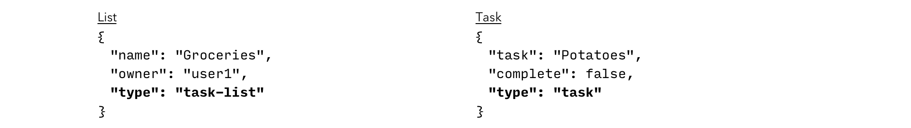
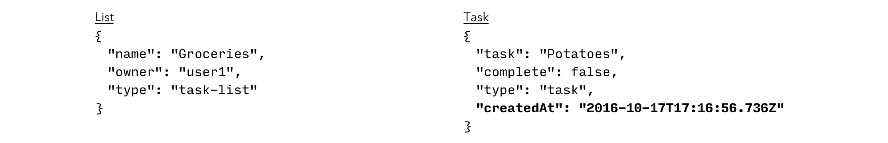
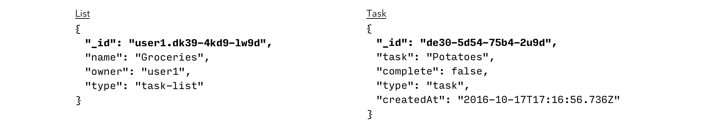
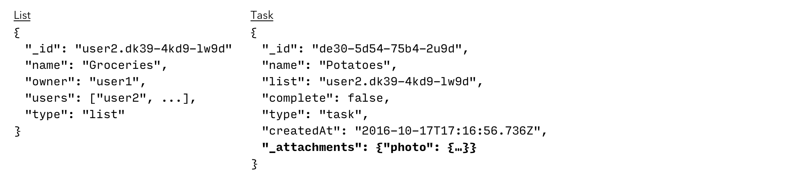

In this lesson you will learn how to model the data for an application and the relationships between the different models.

Initially, the schema for a todo list application may look like the table below.

|List|Task|
|:---|:---|
|name|name|
|owner|list|
|users|complete|

With the following schema relationships:

1. A task belongs to a list.
2. A list belongs to a user.
3. A user can share a list with other users.

Throughout this lesson you will extend this basic data model to meet the requirements of the application.

## From Tables to JSON

Couchbase Mobile stores data in documents rather than in table rows. A document is a JSON object containing a number of key-value pairs. This means that it can take any form as long as it is [valid JSON](http://www.json.org/). The following image represents the same schema as the table above but in JSON format.

We use the `type` property to store the entity name on each document.

## Storing Dates

Another requirement of the application is to sort tasks by the time they were created at. JSON itself does not specify how dates should be represented. To keep chronological ordering with string dates, they should be stored in ISO-8601 format (YYYY-MM-DDThh:mm:ssZ). The following diagram adds a `createdAt` field on the **task** document with the date in ISO-8601 format.

## Document IDs

The document ID can be pre-defined by the application or automatically generated by the database during a write operation. Document IDs can be used to keep a reference to other documents.

The image below adds unique document IDs. It is also used to keep a reference from the **Task** to the **List** document.

There is a one-to-many relationship between list and task documents.

> **Note:** All the fields that start with "\_" are Couchbase specific (i.e `_id`). For this reason, it is not recommended to name your own properties with a leading underscore.

## Attachments

One of the requirements in the application is that tasks can have an image attached to them. Attachments are also persisted to disc and synchronized with the document they belong to. The following diagram adds an attachment called `image` of type `image/jpg` to the **task** document.

## Conclusion

Well done! You've completed this lesson on modeling the data in different documents and the relationships between them. In the next lesson you'll learn how to design the security model for each type of document. Feel free to share your feedback, findings or ask any questions on the forums.