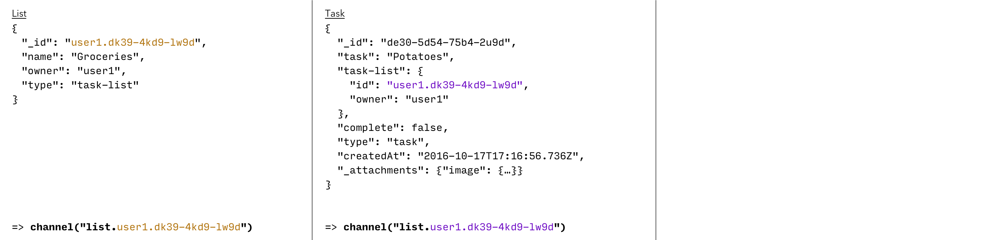
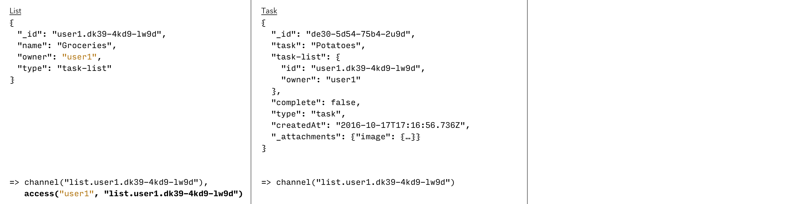
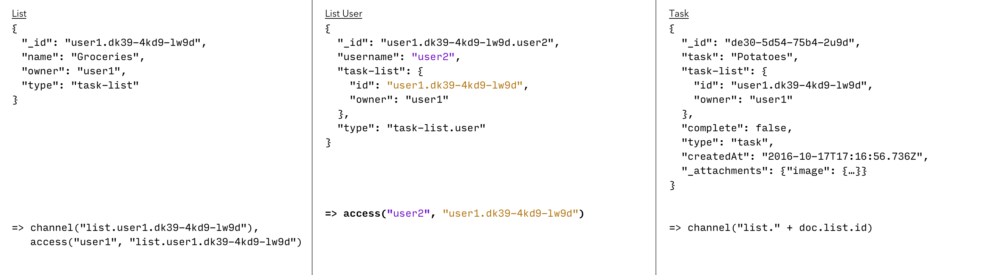
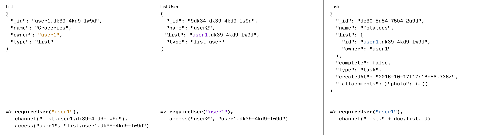
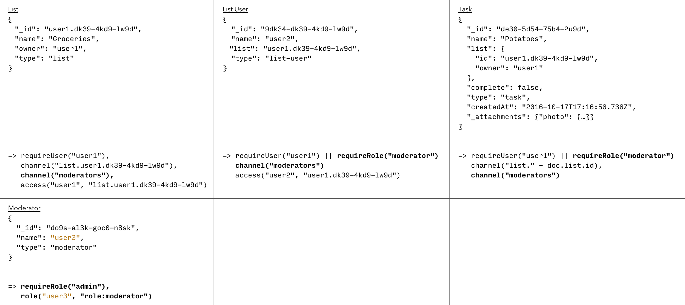

In this lesson you’ll learn how to secure your data model using Couchbase Mobile’s built-in security framework.

Security rules are used to determine who has read and write access to the database. They live on the server in Sync Gateway and are enforced at all times.

Documents can either be created to store data or to grant other users access to data. Most documents fall somewhere in the middle where some properties are used to persist data and others to control access.

In this lesson you will learn how to extend the existing data model to add security to your application.

## Routing

Sync Gateway provides an ability to assign documents to something we call channels. Channels act as an organization mechanism. The graphic below may help to understand how channels work. It shows conceptually the idea of Sync Gateway feeding documents to channels during a replication.

You control assigning documents to channels through the Sync Function. Each blue pipe in the diagram represents a channel. The green arrows illustrate the idea that the sync function can assign any individual document to any number of channels.

The diagram below adds a note to specify a dynamic channel name for task and list documents to be in the same channel.

## Read Access

### Single user

Sync Gateway provides different methods of authenticating users. Regardless of the provider you choose, all of your users are stored in Sync Gateway. The following diagram adds a note to specify that the owner should have read access to the list.

### Multiple users

In the application, any list can be shared with other users. In the **list** document, that's represented by the `users` array. Instead of keeping the list of users on the **list** document itself, you'll create a new document of type `list.user` whose purpose will be to grant a user access to a list. The diagram below adds a note to specify that the document ID of the `list.user` document is responsible for granting user2 access to user1's list.

## Write Access

You must add write access security rules to ensure the system is secure. Generally that means checking that a user is allowed to perform the intended operation. The diagram below adds notes to ensure document can't be created by any user.

As you can see, only owners of a list can invite other users to access it.

## Roles

Another design requirements of the application is that moderators can invite other users to a list they have access to. In out current design this isn't possible because all users have equal privileges. However we can use Sync Gateway roles to assign roles to users to limit or extend write permission privileges. The diagram below adds a `moderator` document whose purpose is to grant a user with the "moderator" role.

## Conclusion

Well done! You've completed this lesson on designing the security model for each scenario in the application. In the next lesson you'll learn how to create an empty database to store documents. Feel free to share your feedback, findings or ask any questions on the forums.