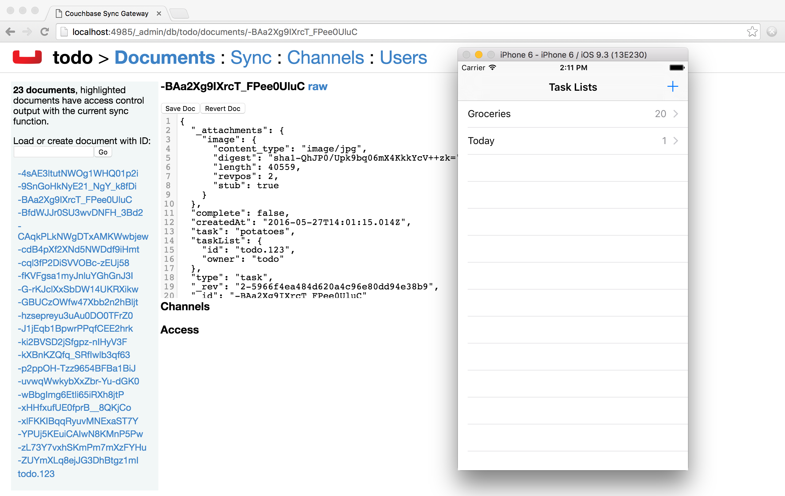
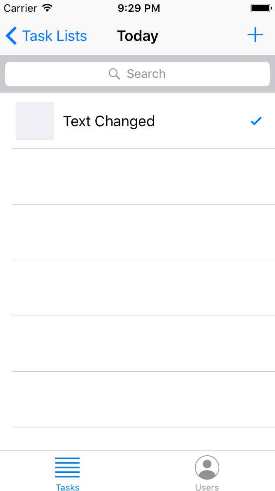

In this lesson you’ll be introduced to Sync Gateway, our secure web gateway. You’ll learn how to use Couchbase Lite’s synchronization APIs, set up Sync Gateway for synchronization with the cloud and other devices, and resolve data conflicts within your application.

[//]: # "COMMON ACROSS LESSONS"

#### Requirements

- Xcode 8 (Swift 3)

#### Getting Started

Download the project below.

<block class="ios" />

<div class="buttons-unit downloads">
  <a href="https://cl.ly/2A2D3q3R2d1g/xcode-project.zip" class="button" id="project">
    
  </a>
</div>

Unzip the file and install the dependencies using Cocoapods.

```bash
$ cd xcode-project
$ pod install
```

Open **Todo.xcodeproj** in Xcode. Then build & run the project.


Throughout this lesson, you will navigate in different files of the Xcode project. We recommend to use the method navigator to scroll to a method.


[//]: # "COMMON ACROSS LESSONS"

> **Tip:** To make things a bit more exciting, you may want to use the pre-built database containing a list of Groceries. Refer to the [Create a Database](/documentation/mobile/current/develop/training/using-the-database/index.html) lesson to learn how to use it.

<block class="ios rn" />

## Install Sync Gateway

Now that your application runs smoothly on the device you are ready to introduce Sync Gateway. Create a new file called **sync-gateway-config.json** with the following.

```javascript
{
  "interface":":4984",
  "log": ["HTTP", "Auth"],
  "databases": {
    "todo": {
      "server": "walrus:",
      "users": {
  		  "GUEST": {"disabled": false, "admin_channels": ["*"] }
      }
    }
  }
}
```

During development, you can set the **server** property to **walrus:** (also known as the Walrus mode) and it will keep the data in memory. Note that anytime you restart Sync Gateway in walrus mode, the database will be empty.

By default, Sync Gateway doesn't allow unauthenticated requests to be processed for security reasons. So you're enabling the **GUEST** user which represents all the unauthenticated clients that will be synchronizing with your Sync Gateway instance.

> **Note:** User authentication is covered in more detail in the [Adding Security](/documentation/mobile/current/develop/training/adding-security/index.html) lesson.

Sync Gateway is always listening on two ports:

- 4984: the public port which will be used from the application.
- 4985: the admin port used for administrative tasks (for security reasons, it’s only accessible on localhost).

### Try it out

1. [Download Sync Gateway](http://www.couchbase.com/nosql-databases/downloads#couchbase-mobile)
2. Unzip the file and locate the executable at **~/Downloads/couchbase-sync-gateway/bin/sync_gateway**
3. Start Sync Gateway from the command-line in your project directory.

    ```bash
    $ sync_gateway sync-gateway-config.json
    ```

> **Note:** You can find the same instructions for the other supported platforms on the [installation guide](/documentation/mobile/current/installation/net/index.html).

<block class="ios rn"/>

## Add synchronization

Typically, an application needs to send data to the server and receive it. In Couchbase Mobile, this is handled by replications which run on the device. A replication requires a Couchbase Lite database and a Sync Gateway URL, and synchronizes data between the two. They can be of two types:

- **Push:** The data is pushed from Couchbase Lite to Sync Gateway.
- **Pull:** The data is pulled from Sync Gateway to Couchbase Lite.

There are a few terminologies that designate the role of each database involved in a replication:

- **Source:** The database where the data is read.
- **Target:** The database where the data is written.
- **Local:** The database that resides where the replication is running.
- **Remote:** The database to which the replication is sending data.

The following code starts a pull and push replication with progress notification.

<block class="ios" />

```swift
// This code can be found in AppDelegate.swift
// in the startReplication(withUsername:andPassword:)
pusher = database.createPushReplication(kSyncGatewayUrl)
pusher.continuous = true
NotificationCenter.default.addObserver(self, selector: #selector(replicationProgress(notification:)),
                                        name: NSNotification.Name.cblReplicationChange, object: pusher)

puller = database.createPullReplication(kSyncGatewayUrl)
puller.continuous = true
NotificationCenter.default.addObserver(self, selector: #selector(replicationProgress(notification:)),
                                        name: NSNotification.Name.cblReplicationChange, object: puller)

if kLoginFlowEnabled {
    let authenticator = CBLAuthenticator.basicAuthenticator(withName: username, password: password!)
    pusher.authenticator = authenticator
    puller.authenticator = authenticator
}

pusher.start()
puller.start()
```

<block class="ios rn" />

### Try it out

<block class="ios" />

1. In **AppDelegate.swift**, set `kSyncGatewayUrl` to the URL of the Sync Gateway database (http://localhost:4984/todo/). If the application is running on a phone, you must replace **localhost** by the internal IP of the machine running Sync Gateway and ensure that the phone and laptop are connected to the same network.

    ```swift
    let kSyncGatewayUrl = URL(string: "http://localhost:4984/todo/")!
    ```

2. Set `kSyncEnabled` to `true` in **AppDelegate.swift**.

    ```swift
    let kSyncEnabled = true
    ```

3. Build and run.
4. Open [http://localhost:4985/_admin/db/todo](http://localhost:4985/_admin/db/todo) in the browser and notice that all the documents are pushed to Sync Gateway! You may have more or less rows depending on how many documents are present in the Couchbase Lite database.



<block class="ios rn" />

## Resolve Conflicts

Due to the unpredictability of mobile connections it's inevitable that more than one device will update the same document simultaneously. Couchbase Lite provides features to resolve these conflicts. The resolution rules are written by the developer to keep full control over which revision should be picked. The most common resolution methods are:

- **Deletes always win:** if one side deletes a document it will always stay deleted, even if the other side has made changes to it later on.
- **N-way merge:** if both sides have updated different properties, the document will end up with the updates from both side.
- **Last update wins:** if both sides have updated the same property, the value will end up as the last one that was updated.

Revisions form a tree data structure and a conflict occurs when there are multiple branches in the revision tree. On the diagram below the conflict is resolved by deleting one branch of the tree (the branch starting at **3-42cc**). The other one is the active branch (i.e the winner) where further child revisions can be persisted (**4-45cb** and **5-42bb**).


### Detecting conflicts

To resolve conflicts you must first learn how to detect them. The code below uses an **allDocs** query which is an index of all the documents in the local database. The **OnlyConflicts** option is passed to report only the documents with conflicts and a **LiveQuery** is used to continuously monitor the database for changes.

<block class="ios" />

```swift
// This code can be found in AppDelegate.swift
// in the startConflictLiveQuery() method
guard kConflictResolution else {
    return
}

conflictsLiveQuery = database.createAllDocumentsQuery().asLive()
conflictsLiveQuery!.allDocsMode = .onlyConflicts
conflictsLiveQuery!.addObserver(self, forKeyPath: "rows", options: .new, context: nil)
conflictsLiveQuery!.start()
```

The query results are then posted to the application code using the KVO observer method.

```swift
// This code can be found in AppDelegate.swift
// in the observeValue(forKeyPath:of:change:context:) method
override func observeValue(forKeyPath keyPath: String?, of object: Any?,
                            change: [NSKeyValueChangeKey : Any]?, context: UnsafeMutableRawPointer?) {
    if object as? NSObject == conflictsLiveQuery {
        resolveConflicts()
    }
}
```

### Automatic conflict resolution

Even if the conflict isn’t resolved, Couchbase Lite has to return something. It chooses one of the two conflicting revisions as the "winner". The choice is deterministic, which means that every device that is faced with the same conflict will pick the same winner, without having to communicate.

Shown below is a list document created with two conflicting revisions. After deleting the row, the text **Update 2** appears which is the name of the second conflicting revision. The action of deleting a document only detetes the current revision and if there are conflicting revisions it will be promoted as the new current revision.


<block class="ios" />

> **Note:** During development, the method `saveAllowingConflicts` is used to intentionally create a conflict. You can shake the device (**^⌘Z** on the simulator) to create a list conflict. The code is located in the `motionEnded(_:with:)` method of **ListsViewController.swift**.

<block class="ios rn" />

This can be surprising at first but it’s the strength of using a distributed database that defers the conflict resolution logic to the application. It’s your responsibility as the developer to ensure conflicts are resolved! Even if you decide to let Couchbase Lite pick the winner you must remove extraneous conflicting revisions to prevent the behaviour observed above. The code below removes all revisions expect the current one.

<block class="ios" />

```swift
// This code can be found in AppDelegate.swift
// in the resolveConflicts(revisions:withProps:andImage:) method
database.inTransaction {
    var i = 0
    for rev in revs as! [CBLSavedRevision] {
        let newRev = rev.createRevision()
        if (i == 0) { // Default winning revision
            newRev.userProperties = props
            if rev.attachmentNamed("image") != image {
                newRev.setAttachmentNamed("image", withContentType: "image/jpg",
                    content: image?.content)
            }
        } else {
            newRev.isDeletion = true
        }

        do {
            try newRev.saveAllowingConflict()
        } catch let error as NSError {
            NSLog("Cannot resolve conflicts with error: %@", error)
            return false
        }
        i += 1
    }
    return true
}
```

<block class="ios rn" />

#### Try it out

<block class="ios" />

1. To enable conflict resolution, set the `kConflictResolution` constant in **AppDelegate.swift** to `true`.

    ```swift
    let kConflictResolution = true
    ```

2. Perform the same actions and this time deleting the list conflict doesn’t reveal the subsequent conflicting revision anymore.
    

<block class="ios rn" />

### N-way conflict resolution

For task documents, you will follow the same steps as previously except this time the conflict resolution will merge the differences between the conflicting revisions into a new revision before removing them. This time, one revision changes the title of the task while the other revision marks it as completed. Here the winning revision is the one that set the **completed** property to true.


> **Note:** To see the same result, open any list and shake the device (**^⌘Z** on the simulator) to create a task conflict. The code is located in the `motionEnded(_:with:)` method of **TasksViewController.swift**.

Similarly to the previous section, you will learn how to resolve conflicts, this time for "task-list" documents. In this case, the resolution code will **merge the updates** (i.e n-way merge) of the conflicting revisions before promoting it as the current revisions.

```swift
// This code can be found in AppDelegate.swift
// in the resolveConflicts() method
let rows = conflictsLiveQuery?.rows
while let row = rows?.nextRow() {
    if let revs = row.conflictingRevisions, revs.count > 1 {
        let defaultWinning = revs[0]
        let type = (defaultWinning["type"] as? String) ?? ""
        switch type {
        // TRAINING: Automatic conflict resolution
        case "task-list", "task-list.user":
            let props = defaultWinning.userProperties
            let image = defaultWinning.attachmentNamed("image")
            resolveConflicts(revisions: revs, withProps: props, andImage: image)
        // TRAINING: N-way merge conflict resolution
        case "task":
            let merged = nWayMergeConflicts(revs: revs)
            resolveConflicts(revisions: revs, withProps: merged.props, andImage: merged.image)
        default:
            break
        }
    }
}
```

Notice that for 'task' documents, the `nWayMergeConflicts()` method is called to merge the differences of conflicting revisions. The method body is too long to copy here but you can find it in **AppDelegate.swift**.

#### Try it out

1. Enable conflict resolution.

    ```swift
    let kConflictResolution = true
    ```

2. Build and run. 
3. Create a task conflict using the shake gesture (or **^⌘Z**) and this time the row contains the updated text **and** is marked as completed.
    

<block class="ios rn" />

## Conclusion

Well done! You've completed this lesson on enabling synchronization, detecting and resolving conflicts. In the next lesson you'll learn how to implement authentication and define access control rules in the Sync Function. Feel free to share your feedback, findings or ask any questions on the forums.
