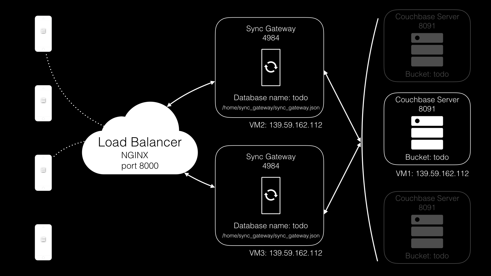

In this lesson you'll learn how to install Sync Gateway and Couchbase Server, our NoSQL database server.

[//]: # "COMMON ACROSS LESSONS"

#### Requirements

Three instances with the following:

- Centos 7
- RAM >= 2GB

#### Getting Started

This lesson contains some scripts to automatically deploy and configure Sync Gateway with Couchbase Server. Download those scripts on each VM using wget.

```bash
ssh vagrant@VM1
wget https://cl.ly/3Z0D2D0l3R0O/deploy_NEEDS_REDO.zip
sudo yum install -y unzip
unzip deploy.zip
```

Throughout this lesson, you will use different scripts located in the **deploy** folder.

[//]: # "COMMON ACROSS LESSONS"

## Architecture

The server-side architecture will be comprised of 2 nodes of Sync Gateway and 1 node of Couchbase Server. Each node will run on a different VM. The diagram below describes the architecture:

- Couchbase Server is running VM1
- Sync Gateway is running on VM2 and VM3



## Install Couchbase Server

To deploy Couchbase Mobile to production you must first get familiar with Couchbase Server. It can deployed on a whole host of [operating systems](http://www.couchbase.com/nosql-databases/downloads) and can scale horizontally with multiple nodes or vertically by increasing the VM specs. The following script downloads Couchbase Server and creates a new bucket called todo.

### Try it out

1. Log on VM1.
1. `cd deploy`
1. Run the **install\_couchbase\_server.sh** script.

    ```bash
    sudo install_couchbase_server.sh
    ```

1. Log on the Couchbase Server Admin Console on [http://VM1_IP:8091](http://VM1_IP:8091) with the user credentials that were created above (**Administrator/password**).

    

    > **Note:** To uninstall Couchbase Server you can run the following: `dpkg -r couchbase-server-community`.

## Install Sync Gateway

Sync Gateway is the middleman server that exposes a database API for Couchbase Lite databases to replicate to and from. It connects internally to a Couchbase Server bucket to persist the documents.

In production, the configuration file should look similar to the one used in development except that instead of using **walrus:** for the bucket it will connect to an instance of Couchbase Server URL as shown below.

```javascript
{
  "interface":":4984",
  "log": ["HTTP", "Auth"],
  "databases": {
    "todo": {
      "server": "http://localhost:8091",
      "bucket": "todo",
      ...
    }
  }
}
```

The `install_sync_gateway.sh` script downloads and installs Sync Gateway 1.3. Then it restarts the `sync_gateway` service with the configuration file of the todo application.


### Try it out 

1. Log on the terminal console of VM2.
1. `cd deploy`
1. Run the Sync Gateway install script passing the IP of VM1 where Couchbase Server is running.

    ```bash
    sudo install_sync_gateway.sh VM1
    ```

1. Monitor the log file.

    ```bash
    tail -f /home/sync_gateway/logs/sync_gateway_error.log
    ```

1. Send a `/{db}/_all_docs` request with the **user1/password** credentials http://VM2_IP:4984/todo. The Sync Gateway logs will print this operation.

    ```bash
    curl -X GET 'http://user1:pass@**VM2**:4984/todo/_all_docs'
    ```

    

1. Repeat the same steps on VM3.

## Using a reverse proxy

With two Sync Gateway nodes you can now configure the reverse proxy and update the sync endpoint in the mobile app to start replications pointing to the reverse proxy instead of an individual Sync Gateway instance.

The following NGINX configuration file balances the traffic between VM2 and VM3.

```bash
upstream sync_gateway {
# sync_gateway_nodes
}
# HTTP server
#
server {
		access_log /var/log/nginx/access_log combined;
		listen 8000;
		client_max_body_size 20m;
		location / {
				proxy_pass              http://sync_gateway;
				proxy_pass_header       Accept;
				proxy_pass_header       Server;
				proxy_http_version      1.1;
				keepalive_requests      1000;
				keepalive_timeout       360s;
				proxy_read_timeout      360s;
		}
}
```

In this example the NGINX instance will run on VM2 to keep the number of VMs to a minimum. You could consider running NGINX on a separate VM (e.g VM4). The `install_nginx.sh` script will install NGINX and configures it for two Sync Gateway instances.


### Try it out

1. Log on the terminal console of VM4.
1. `cd deploy`
1. Run the NGINX install script passing the IP of VM2 and VM3 where the Sync Gateway instances are running.

    ```bash
    sudo install_nginx.sh VM2 VM3
    ```

1. Monitor the NGINX operations in real-time.

    ```bash
    sudo tail -f /var/log/nginx/access_log
    ```

1. Send a `/{db}/_all_docs` request with the **user1/password** credentials to http://VM2_IP:8000/todo. The Sync Gateway logs will print this operation.

    

## Conclusion

Well done! You've completed this lesson on installing Sync Gateway and Couchbase Server. In the next lesson you'll learn how to perform an upgrade on Sync Gateway. Feel free to share your feedback, findings or ask any questions on the forums.