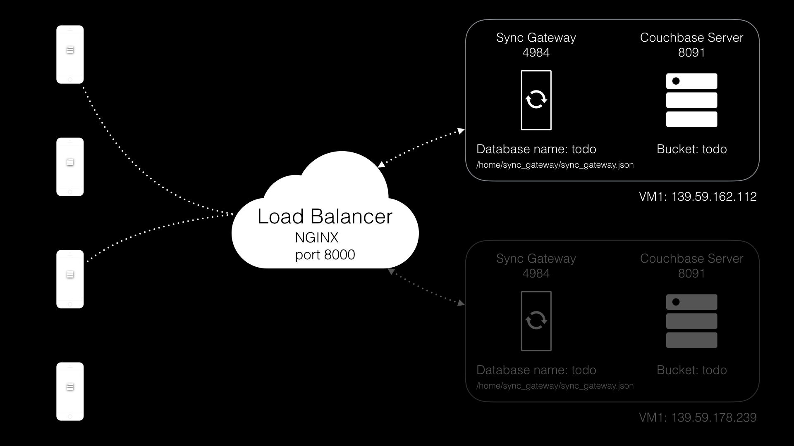

In this lesson you'll learn how to install upgrades for Sync Gateway and Couchbase Server with zero downtime.

#### Requirements

One instance with the following:

- Ubuntu >= 12.04, =< 14.04
- RAM >= 2GB

## Architecture



## Redirect traffic

Before upgrading one of the Sync Gateway node you must redirect the traffic at the reverse proxy level to the only node available. The following NGINX config directs all the traffic to node 2.

```bash
upstream sync_gateway {
server 172.20.30.41:4984 down;
server 172.20.30.42:4984;
}
```

The `down` keyword can be used in an NGINX config to prevent traffic being directed to specific nodes.

### Try it out

1. Update the NGINX configuration located at **** with the snippet above to disable one node.
2. Reload the `nginx` configuration file.

    ```bash
    nginx -s reload
    ```

3. Verify that all the traffic is being directed to the second node.

## Upgrading the node

Sync Gateway has a shared nothing architecture which means that you can modify uninstall or install a new version of it pretty easily. The following bash script uninstalls Sync Gateway 1.3.0 and installs Sync Gateway 1.3.1

```bash
#!/usr/bin/env bash

# Stop Sync Gateway
service sync_gateway stop

# Uninstall Sync Gateway 1.3.0
dpkg -r couchbase-sync-gateway
dpkg -P couchbase-sync-gateway

# Download and Sync Gateway 1.3.1
wget http://packages.couchbase.com/releases/couchbase-sync-gateway/1.3.1/couchbase-sync-gateway-community_1.3.1-16_x86_64.deb
dpkg -i couchbase-sync-gateway-community_1.3.1-16_x86_64.deb
```

### Try it out

1. Log on the terminal console of VM1.
2. Run the upgrade script.
3. Verify that the Sync Gateway version is now 1.3.1

    ```bash
    curl localhost:4984

    {"couchdb":"Welcome","vendor":{"name":"Couchbase Sync Gateway","version":1.3},"version":"Couchbase Sync Gateway/1.3.1(16;f18e833)"}
    ```

4. Modify the NGINX config file to rebalance the traffic between each node.
5. Verify that requests are going to both nodes.

// gif

## Conclusion

Well done! You've completed this lesson on upgrading the Sync Gateway version. In the next lesson you will learn how to scale Sync Gatway by adding additional nodes. Feel free to share your feedback, findings or ask any questions on the forums.