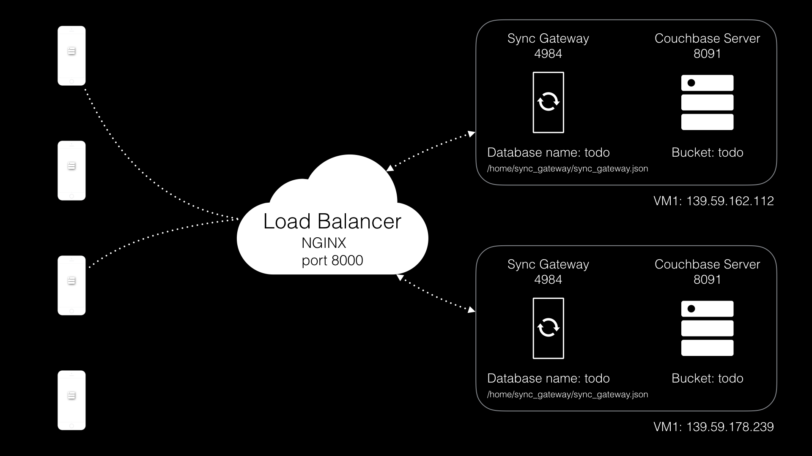

In this lesson you'll learn how to scale Sync Gateway and Couchbase Server in real-time with zero downtime.

#### Requirements

Two instances with the following:

- Ubuntu >= 12.04, =< 14.04
- RAM >= 2GB

## Architecture

In the previous lesson you already deployed 1 node of Sync Gateway and 1 node of Couchbase Server on the same Ubuntu instance. In this lesson you will deploy an additional set of Sync Gateway and Couchbase Server to another Ubuntu instance. The diagram describes the architecture. With two Sync Gateway instances you will also deploy a reverse proxy to distribute the load between each one. Both Sync Gateways will use the exact same configuration file.



## Scaling Sync Gateway

There are two ways in which Sync Gateway can scale:

- **Vertically:** A single instance running on a quad-core/4GB virtual machine can handle up to 5000 users in normal load conditions. One way of increasing the load that can be handled is by increasing the virtual machine specs.
- **Horizontally:** By running identically configured instances of Sync Gateway on each of several machines, and load-balancing them by directing each incoming HTTP request to a random one. Sync Gateway nodes are “shared-nothing,” so they don’t need to coordinate any state or even know about each other.

### Try it out

1. Access the second VM instance.
2. Follow the instructions from the [Install](https://google.com) to deploy Sync Gateway only on the second virtual machine. You will deploy another node of Couchbase Server later in this lesson.

## Scaling Couchbase Server

### Try it out

1. Download Couchbase Server 4.1 using `wget`.

    ```bash
    wget http://packages.couchbase.com/releases/4.1.0/couchbase-server-community_4.1.0-ubuntu14.04_amd64.deb
    ```

2. Install Couchbase Server 4.1 using `dpkg`.

    ```bash
    dpkg -i couchbase-server-community_4.1.0-ubuntu14.04_amd64.deb
    ```

3. Add this Couchbase Server instance to the existing cluster.

    ```bash
    /opt/couchbase/bin/couchbase-cli server-add --cluster localhost:8091 --server-add=139.59.178.239:8091 --server-add-username=Administrator --server-add-password=password -u Administrator -p password
    ```

4. Start the rebalance.

    ```bash
    /opt/couchbase/bin/couchbase-cli rebalance -c localhost:8091 --server-add-username=Administrator --server-add-password=password -u Administrator -p password
    ```

5. The Couchbase Server Admin Console now contains 2 nodes.

    

## Conclusion

Well done! You've completed this lesson on scaling. Feel free to share your feedback, findings or ask any questions on the forums.