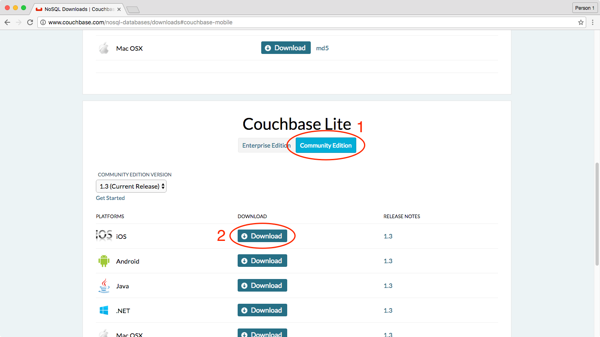
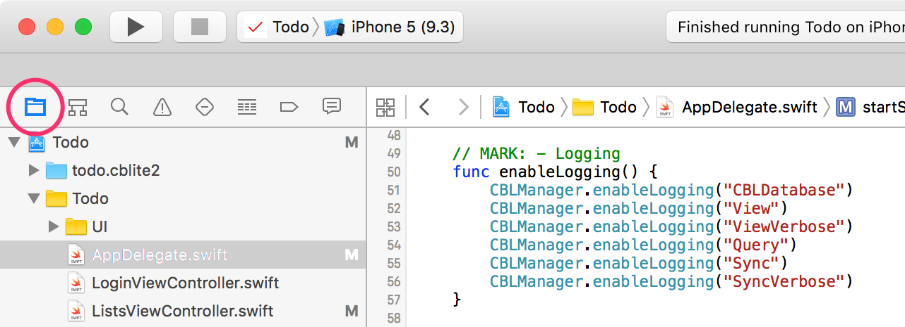

In this lesson you’ll be introduced to Couchbase Lite, our embedded NoSQL database. You’ll learn how to create a new embedded database and optionally use databases pre-packaged in your application. Then, you’ll learn how to create, read, update, delete, and query data using Couchbase Lite. 

To save us time coding the user interface for the application, download the starter project below.

<block class="ios" />

<div class="buttons-unit downloads">
  <a href="https://cl.ly/2p331I461Z20/part1_start.zip" class="button" id="project">
    Download the Xcode starter project
  </a>
</div>

<block class="rn" />

This is the **download** button for the react native plugin

<block class="ios" />

<div class="buttons-unit downloads">
  <a href="http://www.couchbase.com/nosql-databases/downloads#couchbase-mobile" class="button red">
    Download Couchbase Lite for iOS
  </a>
</div>



Unzip the file and drag **CouchbaseLite.framework** to the **Frameworks** folder in Finder. It's important to do this in Finder as opposed to Xcode.


Open **Todo.xcodeproj** in Xcode.

<block class="rn" />

<block class="ios rn" />

Build & run the project in Xcode.


The user interface is functional and you can navigate through the app but nothing gets persisted.

The entrypoint in the Couchbase Lite SDK is the `Manager` class. You can use it to create a new database called **todo**.

```swift
let manager = CBLManager.sharedInstance()
var error: NSError?
let database = manager.databaseNamed("todo", error: &error)
if self.database == nil {
    self.handleError(error)
}
```

There is no limit to how many databases can be created or opened on the device. You can think of a database as a namespace for documents and several databases can be used in the same app (one database per user of the app is a common pattern). A database is stored in the application directory and is only accessible from this application.

However, in this lesson, you will use a **pre-built** database that already contains a grocery list. You can bundle a pre-built database in your application if your app needs to sync a lot of static data initially. This lesson only covers how to bundle a **pre-built** database; refer to the [Database](/documentation/mobile/current/develop/guides/couchbase-lite/native-api/database/index.html) guide to learn how to create **pre-built** databases.

> **Note:** This is optional and in most cases, apps start with an empty Couchbase Lite database using the `databaseNamed` method where data is added by the user or through synchronization with Sync Gateway.

Download the **pre-built** database from the link below and follow the instructions.

[Download the pre-built database](https://cl.ly/453l3M1O151a/prebuilt-db.zip)

<block class="ios" />

- Unzip the file.
- Open the prebuilt-db folder and drag **todo.cblite2** to the Copy Bundle Resources on the Build Phases tab in Xcode.


Be sure to check the **Copy items if needed** and **Create folder references** options from the dropdown panel.


<block class="ios rn" />

Next, you will write some code to initialize Couchbase Lite and import the prebuilt database in the application.

<block class="ios" />

- Open **AppDelegate.swift**.
    
    

- Locate the `application(_:didFinishLaunchingWithOptions)` method.

    

- This method is called by the OS when the application starts but it’s missing the code to use the pre-built database.
- Complete it with the following under the `// missing code` comment.

```swift
let manager = CBLManager.sharedInstance()
do {
    try database = manager.existingDatabaseNamed("todo")
} catch let error as NSError {
    NSLog("Error %@", error)
}
if database == nil {
    let cannedDBPath = NSBundle.mainBundle().pathForResource("todo", ofType: "cblite2")
    do {
        try manager.replaceDatabaseNamed("todo", withDatabaseDir: cannedDBPath!)
    } catch let error as NSError {
        NSLog("Cannot replace the database %@", error)
    }
}
```

This code copies the database from the application bundle to the Couchbase Lite files directory.

Add the following just below the previous code segment in the `applicationDidFinishLaunchingWithOptions` method.

```swift
do {
    try database = manager.databaseNamed("todo")
} catch let error as NSError {
    NSLog("Cannot open the database: %@", error)
    return false
}
```

Here, you're using the [databaseNamed](/documentation/mobile/current/develop/guides/couchbase-lite/native-api/database/index.html#opening-a-database) method to open the database and store a reference to it as a property on the `AppDelegate` class.

<block class="rn" />

<block class="ios rn" />

With the database in place you are now ready to persist documents.

## Create a Document

Notice that the navigation bar already has a button that prompts the user to enter a name for a new list but the value isn't persisted (it doesn't appear on the list after pressing 'OK'). In this section you will learn how to create a new document and save it to the database.

<block class="ios" />


- Locate the `createTaskList` method in **ListsViewController.swift**, it is called when the user clicks the OK button passing the text input value.
- The body of this method is empty though, add the following to create and save a new document.

```swift
let properties = [
    "type": "task-list",
    "name": name
]
let doc = database.createDocument()
do {
    return try doc.putProperties(properties)
} catch let error as NSError {
    Ui.showMessageDialog(onController: self, withTitle: "Error",
        withMessage: "Couldn't save task list", withError: error)
	return nil
}
```

<block class="ios rn" />

The `createDocument` method returns a [Document](/documentation/mobile/current/develop/guides/couchbase-lite/native-api/document/index.html) instance. The only constraint on a document is that its document ID must be unique (i.e. the **_id** property in the document’s JSON body). You can create a document with a known ID using the `documentWithID` method or let the database generate one for you (using the `createDocument` method), as it is the case here.

If you build and run and save a new list it will not appear on the screen because the code to query lists is missing. In the next section you will learn how to query documents in a Couchbase Lite database.

## Query Documents

The way to query data in Couchbase Lite is by registering a View and then running a Query on it with **QueryOptions**. The first thing to know about Couchbase Views is that they have nothing to do with UI views.

A [View](/documentation/mobile/current/develop/guides/couchbase-lite/native-api/view/index.html) in Couchbase is a persistent index of documents in a database, which you then query to find data. The main component of a View is its map function. It takes a document’s JSON as input, and emits (outputs) any number of key/value pairs to be indexed. First, you will define the view to index the documents of type **task-list**. The diagram below shows the result of that map function.


So you can remember that a view index is a list of key/value pairs, sorted by key. In your application, the view’s logic is written in the native language of the platform you’re developing on.

<block class="ios" />

- Open **ListsViewController.swift** and locate the `setupViewAndQuery` method.
- This method is called in `viewDidLoad` but its body is empty at the moment.
- Complete it with the following.

```swift
let listsView = database.viewNamed("list/listsByName")
if listsView.mapBlock == nil {
    listsView.setMapBlock({ (doc, emit) in
        if let type: String = doc["type"] as? String, name = doc["name"]
            where type == "task-list" {
                emit(name, nil)
        }
    }, version: "1.0")
}
```

<block class="rn" />

<block class="ios rn" />

The **viewNamed** method returns a [View](http://developer.couchbase.com/documentation/mobile/current/develop/guides/couchbase-lite/native-api/view/index.html) object on which the map function can be set. The map function is indexing documents where the type property is equal to "task-list". Each cell on the screen will contain a list name and nothing else. For that reason, you can emit the name property as the key and nil is the value. If you also wanted to display the owner of the list in the row you could emit the `owner` property as the value.

With the View defined you are now ready to run the Query.

<block class="ios" />

In the `setupViewAndQuery` method add the following below the previous code snippet.

```swift
listsLiveQuery = listsView.createQuery().asLiveQuery()
listsLiveQuery.addObserver(self, forKeyPath: "rows", options: .New, context: nil)
listsLiveQuery.start()
```

<block class="rn" />

<block class="ios rn" />

The `listsView.createQuery()` method returns a [Query](/documentation/mobile/current/develop/guides/couchbase-lite/native-api/query/index.html) object which has a **run** method to return the results as a [QueryEnumerator](/documentation/mobile/current/develop/references/couchbase-lite/couchbase-lite/query/query-enumerator/index.html) object. However, in this case, you are hooking into a [Live Query](/documentation/mobile/current/develop/guides/couchbase-lite/native-api/query/index.html) to keep monitoring the database for new results. Any time the result of that query changes through user interaction or synchronization, it will notify your application via the change event. A live query provides an easy way to build reactive UIs, which will be especially useful when you enable sync in the [Adding Synchronization](/documentation/mobile/current/develop/training/adding-synchronization/index.html) lesson. The change event is triggered as a result of user interaction locally as well as during synchronization with Sync Gateway.


The notifications are posted to the application code using the idiomatic APIs on each platform (KVO, change event, callback).

<block class="ios" />

- Open **ListsViewController.swift** and locate the `observeValueForKeyPath` method.
- This method is called every time there is a change in the query result.
- Call the `reloadTaskLists` method in the body of `observeValueForKeyPath` to reload the Table View. 

Build and run. You will see the "Groceries" list that was imported from the pre-built database and the list you added in the first step of this lesson.


Save a new list to the database and the live query will pick it up to reload the **UI**.

The code to display the tasks is already added to the starter project. You can therefore see the items in the Groceries list.

[//]: # "TODO: Link to gif. It's there in ./img but AuthX ingestion ignores GIFs."


[//]: # "TODO: Add some cartoon."

## Update a Document

Swipe to the left on a row to reveal the **Edit** and **Delete** buttons.


The Edit popup prompts the user to enter the new list name. Now you will add the code to update an existing document.

- The `updateTaskList` method in **ListsViewController.swift** is called when the user clicks the OK button passing the text input value.
- Fill in the missing code in `updateTaskList` with the following.

```swift
do {
    try list.update { newRev in
        newRev["name"] = name
        return true
    }
} catch let error as NSError {
    Ui.showMessageDialog(onController: self, withTitle: "Error",
        withMessage: "Couldn't update task list", withError: error)
}
```

<block class="ios rn" />

The update method takes a callback function or block (the details vary by language). It loads the current revision's properties, then calls this function, passing it an [UnsavedRevision](/documentation/mobile/current/develop/guides/couchbase-lite/native-api/revision/index.html#saved-vs-unsaved-revision) object, whose properties are a mutable copy of the current ones. Your callback code can modify this object's properties as it sees fit; after it returns, the modified revision is saved and becomes the current one.

Build and run. You should now be able to change the name of a list.

<block class="ios" />


## Delete a Document

Finally, you will add the code to delete a document.

- Locate the `deleteTaskList` method in **ListsViewController.swift**, it is called when the user clicks the **Delete** action.
- The body of this method is empty though, add the following to delete the document.

```swift
do {
    try list.deleteDocument()
} catch let error as NSError {
    Ui.showMessageDialog(onController: self, withTitle: "Error",
        withMessage: "Couldn't delete task list", withError: error)
}
```

Build and run. Click the **Delete** action to delete a list.

<block class="rn" />

<block class="ios rn" />

Well done! You can now create, edit and delete lists.

## Aggregating Data

A problem in typical applications is how to perform data aggregation. Couchbase Lite lets you run those data queries using the full capabilities of map/reduce. To run aggregation queries on the rows emitted by the map function, you can use the reduce function which is the part of map/reduce that takes several rows from the index and aggregates them together in a single object.

Let’s write a view to query and display the number of uncompleted tasks for each list. A task is marked as completed if its **complete** property is true. You need to define a **map** function which returns the number of uncompleted task documents, **group** them by the list they belong to and **count** the number of rows in each group.


Notice that **groupingLevel = 1** coalesces the rows in the view index by their key.

[Grouping](/documentation/mobile/current/develop/guides/couchbase-lite/native-api/query/index.html) is a powerful feature of Couchbase Lite. It is available on a **Query** using the **groupLevel** property, which is a number, and it defaults to 0. It basically takes the entire range of output that the query produces (i.e. the entire range of rows) and it coalesces together adjacent rows with the same key.

The most commonly used reduce functions are Count and Sum:

- Count: A function that counts the number of documents contained in the map (used on the diagram above).
- Sum: A function that adds all of the items contained in the map.

Now you are ready to write the view to query the number of uncompleted tasks for each list.

<block class="ios" />

- Open **ListsViewController.swift** and locate the `setupViewAndQuery` method you already updated in the previous step.
- Add the following below the existing code.

```swift
let incompTasksCountView = database.viewNamed("list/incompleteTasksCount")
if incompTasksCountView.mapBlock == nil {
    incompTasksCountView.setMapBlock({ (doc, emit) in
        if let type: String = doc["type"] as? String where type == "task" {
            if let list = doc["taskList"] as? [String: AnyObject], listId = list["id"],
                complete = doc["complete"] as? Bool where !complete {
                emit(listId, nil)
            }
        }
        }, reduceBlock: { (keys, values, reredeuce) in
            return values.count
        }, version: "1.0")
}
incompTasksCountsLiveQuery = incompTasksCountView.createQuery().asLiveQuery()
incompTasksCountsLiveQuery.groupLevel = 1
incompTasksCountsLiveQuery.addObserver(self, forKeyPath: "rows", options: .New, context: nil)
incompTasksCountsLiveQuery.start()
```

<block class="rn" />

<block class="ios rn" />

This time, you call emit only if the document `type` is "task" and **complete is false**. The document ID of the list it belongs to (**doc.taskList._id**) serves as the key and the value is nil. The reduce function simply counts the number of rows with the same key. Notice that the **groupLevel** is a property on the live query object.

<block class="rn" />

- Open **Lists.js** and locate the `componentWillMount` method you already updated in the previous step.
- Add the following below the existing code.

Register the `incompleteTasksCount` view:

```javascript
    var listsViews = {
      views: {
        listsByName: {
          map: function (doc, meta) {
            if (doc.type == "task-list") {
              emit(doc.name, null);
            }
          }.toString()
        },
        incompleteTasksCount: {
          map: function (doc, meta) {
            if (doc.type == "task") {
              emit(doc.taskList.id, null);
            }
          }.toString(),
          reduce: function(keys, values, rereduce) {
            return values.length;
          }.toString()
        }
      }
    };
    client.query.put_db_design_ddoc({db: 'todo', ddoc: 'list', body: listsViews})
      .then(res => {
        console.log(res)
        alert('Lists design document was created');
      })
      .catch(err => {console.log(err);})
```

Query the `incompleteTasksCount` view in the `componentWillMount` method:

```javascript
client.query.get_db_design_ddoc_view_view({
    db: 'todo', ddoc: 'list',
    view: 'incompleteTasksCount', group_level: 1
})
    .then(res => {
    console.log("list/incompleteTasksCount query result :: ", res.obj);
    var rows = res.obj.rows;
    var counts = {};
    for (var i = 0; i < rows.length; i++) {
        counts[rows[i].key] = rows[i].value;
    }
    this.setState({incompleteTasksCount: counts})
    });
```

<block class="ios rn" />

Similarly to the previous query, you need to register for live query updates.

<block class="ios" />

Update the body of the `observeValueForKeyPath` method.

```swift
if object as? NSObject == listsLiveQuery {
    reloadTaskLists()
} else if object as? NSObject == incompTasksCountsLiveQuery {
    reloadIncompleteTasksCounts()
}
```

<block class="rn" />

<block class="ios rn" />

Build and run. You should now see the uncompleted task count for each list.

<block class="ios" />


<block class="ios rn" />

Well done! You've successfully learned how to use a prebuilt Couchbase Lite database, define views to query the documents to be displayed in a list and perform write, update and delete operations. You can download the final project as a downloadable zip below. Feel free to share your feedback, findings or ask any questions in the forums.

<div class="buttons-unit downloads">
  <a href="https://cl.ly/2t1b0Q2k3441/part1_final.zip" class="button">
    Download final project
  </a>
</div>